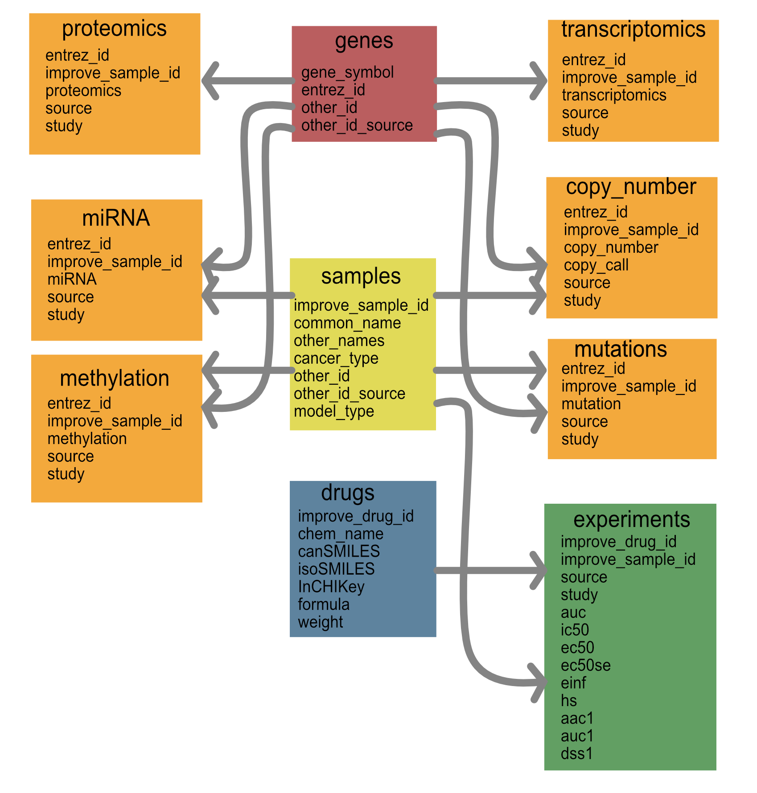

## CANDLE Data Processing

This repository leverages existing datasets to collect the data
required for CANDLE data analysis. Since each deep learning model
requires distinct data capabilities, the goal of this repository is to
collect and format all data into a schema that can be leveraged for
existing models.

The goal of this repository is two-fold: First, it aims to collate and
standardize the data for all CANDLE related models. This requires
running a series of scripts to build and append to a standardized data
model. Second, it has a series of scripts that pull from the data
model to create model-specific data files that can be run by the data
infrastructure. 

# IMPROVE Data Model

The goal of the data model is to collate drug response data together with molecular data in a way that can be easily ingested by machine learning models. The overall schema is shown below.

We will store the data in tables that are represented by the files below. Each data-specific model can be generated from a smaller set of these tables. The schema for these tables is represented below. 

The files are comma-delimited and named follows:
1. genes.csv
2. drugs.tsv.gz --> Drug names have commas and quotes in them, therefore require tab delimited
3. samples.csv
4. experiments.csv.gz --> compressed to fit on github
5. transcriptomics.csv.gz
6. mutations.csv.gz 
7. copy_number.csv.gz
8. methylation.csv.gz
9. mirnas.csv.gz

## Building the data model

| Data model step | Description/Dependencies| Script | Destination | 
| --- | --- | --- |
| Build cell line data | Runs through PGX and existing CCLE data to compile all values | [cell_line/buildInitialDataset.py](cell_line/buildInitialDataset.py)| [./cell_line]
| Build cptac data | This uses tehe genes files created in the [./cell_line] directory but generates additional samples. |
[cptac/getCptacData.py](cptac/getCptacData.py) | [./cptac]
| Get HCMI data | This uses a fixed manifest to download the data into the proper schema | TBD | [./hcmi]
| --- | --- | --- |

## Current data 
What data is stored here? 

## Using the data model

Files are stored on FigShare. We need to build a script that pulls those data as needed.
