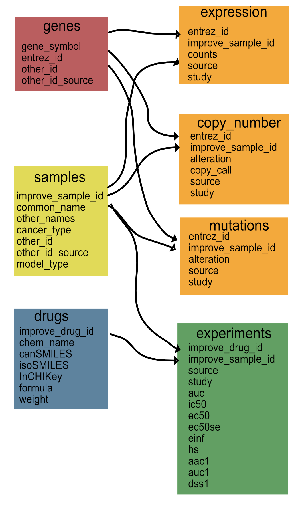
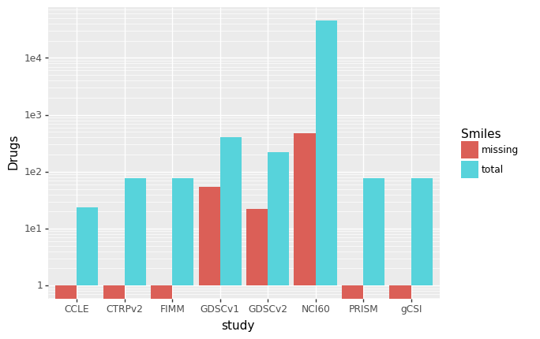

# Data Description

This directory stores the data files and tools needed to wrangle the cell line files. We leverage CCLE data from DepMap for the gene expression data and PharmacoGX for the drug data

### CCLE Data processing

#### Sample mapping
The sample mapping file is derived from the DepMap identifiers and cellosaurus for now. 

### PharmacoGX processing

One way to assemble these data is to use the PharmacoGX package and the curve fitting code. To do so, we have created custom scripts in the [../pgx](../pgx/) directory that collect the data available. Each dataset has slightly different data so we have collated it as needed and put it into the tables above.

#### Curve fitting
The curve fitting is all run through a modified version of the code at the [curve repository](https://github.com/levinas/curve). 

# Model-specific data files

We then need to capture, for each deep learning model, the data necessary to train/build model. The code to do this should operate on the standard schema defined above so it can be re-run as we collect new data

Once we get a basic schema assigned we can start to write this code.

## Data Schema

The data schema for the aggregated data is shown above. There are three scripts that seed the data schema:
1- [initialSampleDB.R](./initialSampleDB.R): This script pulls from Cellosaurus and DepMap files to create an additional mapping of cell line data. Once initially created, each experiment measurement will append to this table if the sample is not already in the file.
2- [initialGeneDB.R](./initialSampleDB.R): This script pulls from 

### Data quality control

We are currently evaulating the data quality and updating the figures monitoring this below.

_Missing Smiles_: some drugs are missing smiles

_Missing ic50s_: some dose response curves could not be fit

_Duplicate measuresments_: various drugs and cell lines were tested more than once. 

### Data model generation

For each model, we will write scripts that map the aggregated data to the data needed for each curated model.

List of models:
As we generate model data, list models and scripts here.
