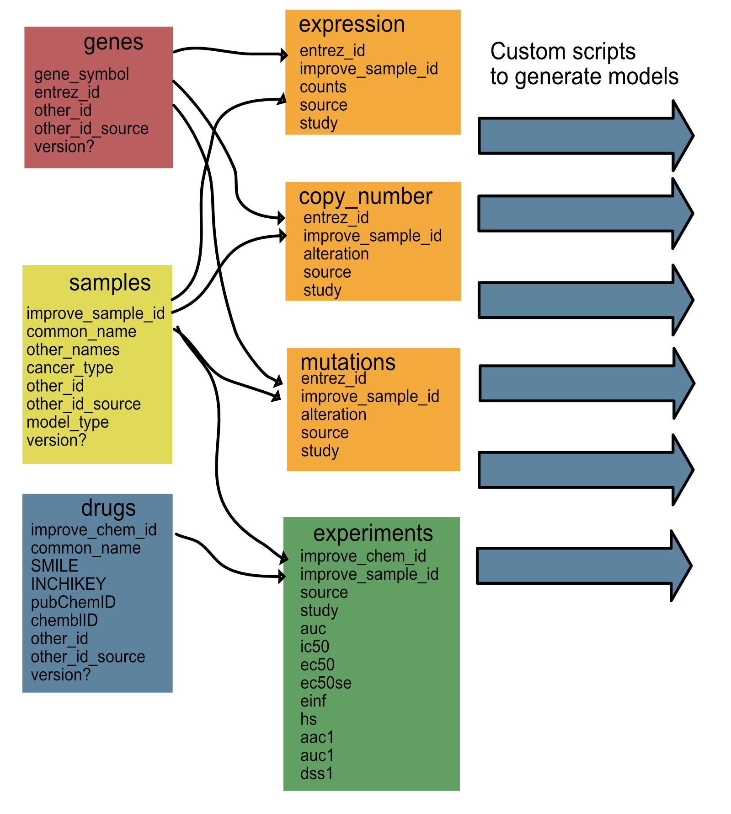

# Data Description

This directory stores the data files and tools needed to wrangle the files. They can be easily downloaded from this GitHub site or the scripts can be run remotely. The data processing for CANDLE falls into two primary parts. The aggregated data schema, which stores all the data for training/test/validation and the model-specific data, which uses the aggregated data 

## Data Schema

The data schema for the aggregated data is shown above. There are three scripts that seed the data schema:
1- [initialSampleDB.R](./initialSampleDB.R): This script pulls from Cellosaurus and DepMap files to create an additional mapping of cell line data. Once initially created, each experiment measurement will append to this table if the sample is not already in the file.
2- [initialGeneDB.R](./initialSampleDB.R): This script pulls from 

### Data model generation

For each model, we will write scripts that map the aggregated data to the data needed for each curated model.

List of models:
As we generate model data, list models and scripts here.
