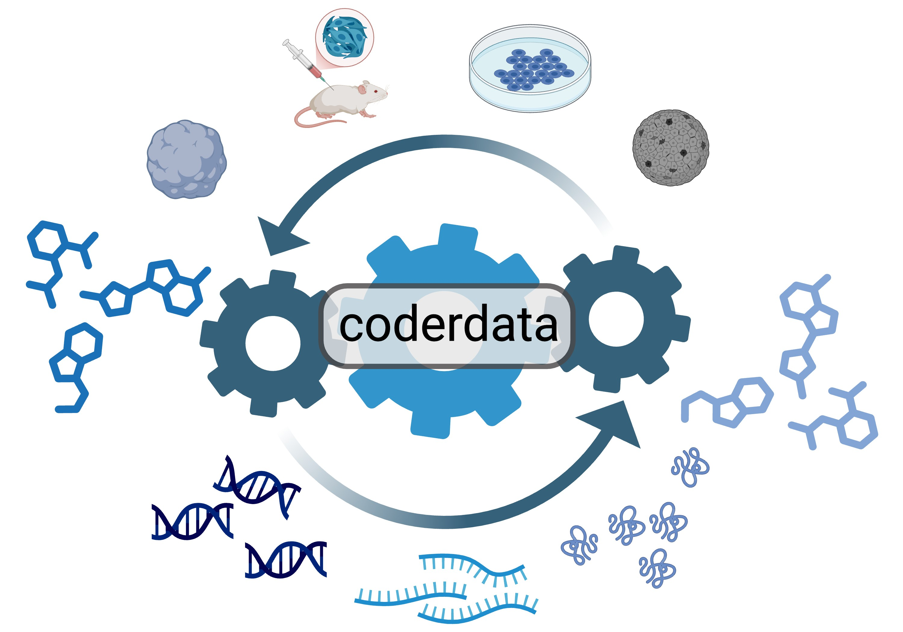

.. CoderData documentation master file, created by
   sphinx-quickstart on Wed Jun 25 13:57:22 2025.
   You can adapt this file completely to your liking, but it should at least
   contain the root `toctree` directive.
.. sphinxdoc

=============
**CoderData**
=============

.. necessary toctree for sphinx (it doesnt't do anything except suppress angry sphinx warnings during build)

.. toctree::
   :hidden:
   :maxdepth: 2

   usage
   APIreference
   datasets_included
   tutorials
   contribution

.. raw:: html

	

		

        	<h4>Usage</h4> 
    	

		

        	<h4>API Reference</h4>
    	

		

        	<h4>Datasets</h4>
    	

		

      		<h4>Tutorials</h4>
    	

		

        	<h4>Contributing</h4>
    	

 	

Introduction
============

-------------------------------------------------------------------------------

There is a recent explosion of deep learning algorithms that exist to tackle the computational problem of **predicting drug treatment outcome from baseline molecular measurements**. 
To support this, we have built a benchmark dataset that harmonizes diverse datasets to better assess algorithm performance.
**Cancer Omics and Drug Experiment Response Data** (CoderData) is a **comprehensive package** designed for handling **cancer benchmark data in Python**. 
This package collects diverse sets of paired molecular datasets with corresponding drug sensitivity data. 
All data here is reprocessed and standardized so it can be easily used as a benchmark dataset for AI learning algorithms.

CoderData provides functionality to manage datasets in a flexible way.
Users can **download datasets, load them into computing environments, and reformat them according to their specific needs**.
It gathers and restructures 16 datasets from multiple databases, harmonizing dataset structure and format, therefore making the dataset accessible for both users and algorithms. 
Curation of molecular datasets with drug sensitivity data that is AI ready allows researchers to develop advanced predictive models. 
By simplifying data utility and ensuring readiness for AI applications, CoderData minimizes the barriers with benchmarking models for cancer treatment prediction. 

Install
=======

-------------------------------------------------------------------------------

CoderData is a Python package that can be installed in any Python environment and utilized in any Integrated Development Environment (IDE) for data processing and manipulation.

``coderdata`` requires ``python>=3.9`` to be installed.

.. code-block:: shell
	:caption: The installed version can be checked via

	$ python --version
	Python 3.13.1

If a Python version older than 3.9 is installed please refer to the instruction at `python.org <https://www.python.org/about/gettingstarted/#installing>`_ on how to install / update Python.

The preferred way to install ``coderdata`` is via ``pip``.
Executing the command below will install the most recent published version of ``coderdata`` including all required dependencies.

.. code-block:: shell  

	$ pip install coderdata

To check if the package has been successfully installed open an interactive python terminal and import the package.

.. code-block:: python
	:caption: See an example of what to expect below.

	>>> import coderdata as cd
	>>> cd.__version__
	'2.1.0'
