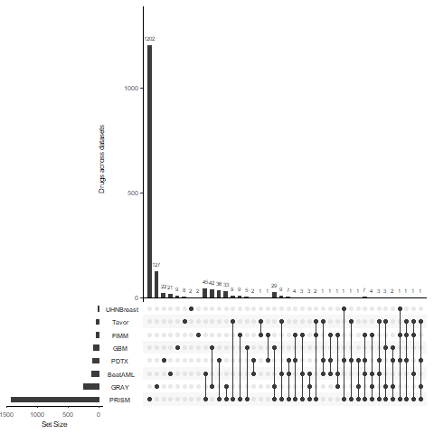
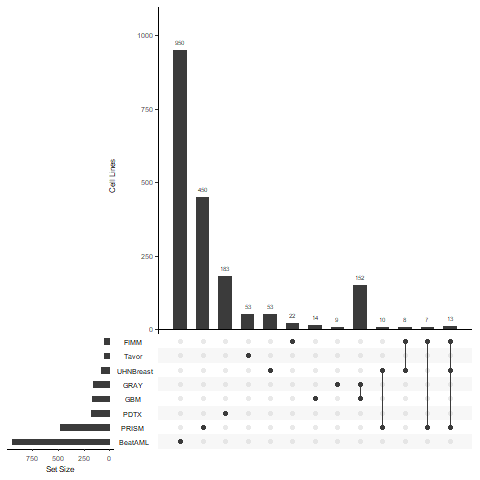

### PharmacoGX Data

Here we use the PharmacoGX R package to collect many diverse datasets. 

Below is a list of datasets in the package |  and whether or not they have been processed before by other IMPROVE collaborators.

Already processed? | Dataset Name | Date Created | PSet Name | version | type | DOI | Download
--- | --- | --- | --- | --- | --- |  --- | ---
No | BeatAML | 2021-03-05T16:55:27.968Z | BeatAML_2018 | 2018 | sensitivity | 10.5281/zenodo.6027929 | https://zenodo.org/record/6027929/files/BeatAML.rds?download=1
N/A | gCSI | 2021-06-11T21:58:16.390Z | gCSI_2019 | 2019 | NA | 10.5281/zenodo.4737437 | https://zenodo.org/record/4737437/files/gCSI2.rds?download=1
Yes | CTRPv2 | 2020-06-24T14:39:26.588Z | CTRPv2_2015 | 2015 | sensitivity | 10.5281/zenodo.3905470 | https://zenodo.org/record/3905470/files/CTRPv2.rds?download=1
Yes | GDSC | 2021-12-16T19:58:28.388Z | GDSC_2020(v2-8.2) | 2020(v2-8.2) | sensitivity | 10.5281/zenodo.5787145 | https://zenodo.org/record/5787145/files/GDSC2.rds?download=1
No | UHNBreast | 2020-06-24T14:39:26.588Z | UHNBreast_2019 | 2019 | both | 10.5281/zenodo.3905460 | https://zenodo.org/record/3905460/files/UHNBreast.rds?download=1
Yes | GDSC | 2021-12-16T19:10:35.091Z | GDSC_2020(v1-8.2) | 2020(v1-8.2) | sensitivity | 10.5281/zenodo.5787084 | https://zenodo.org/record/5787084/files/GDSC1.rds?download=1
No | PRISM | 2021-08-18T16:28:45.207Z | PRISM_2020 | 2020 | sensitivity | 10.5281/zenodo.5570757 | https://zenodo.org/record/5570757/files/PRISM.rds?download=1
No | PDTX | 2022-01-07T00:00:00.000Z | PDTX_2019 | 2019 | NA | 10.5281/zenodo.5827919 | https://zenodo.org/record/5827919/files/PDTXBreast.rds?download=1
No | FIMM | 2020-06-24T14:39:26.588Z | FIMM_2016 | 2016 | sensitivity | 10.5281/zenodo.3905448 | https://zenodo.org/record/3905448/files/FIMM.rds?download=1
No | Tavor | 2021-03-05T17:05:08.535Z | Tavor_2020 | 2020 | sensitivity | 10.5281/zenodo.5979590 | https://zenodo.org/record/5979590/files/Tavor.rds?download=1
No | GBM | 2022-01-07T00:00:00.000Z | GBM_2021_scr3 | 2021 | NA | 10.5281/zenodo.5827917 | https://zenodo.org/record/5827917/files/GBM_scr3.rds?download=1
Yes | CCLE | 2020-06-24T14:39:26.588Z | CCLE_2015 | 2015 | sensitivity | 10.5281/zenodo.3905461 | https://zenodo.org/record/3905462/files/CCLE.rds?download=1
Yes | NCI60 | 2021-08-18T16:28:45.207Z | NCI60_2021 | 2021 | sensitivity | 10.5281/zenodo.5570629 | https://zenodo.org/record/5570629/files/NCI60.rds?download=1
No | GBM | 2022-01-07T00:00:00.000Z | GBM_2021_scr2 | 2021 | NA | 10.5281/zenodo.5827902 | https://zenodo.org/record/5827902/files/GBM_scr2.rds?download=1
No | GRAY | 2021-02-23T14:39:26.588Z | GRAY_2017 | 2017 | sensitivity | 10.5281/zenodo.4557735 | https://zenodo.org/record/4557735/files/GRAY2017.rds?download=1

The datasets that have not been analyzed still have many drugs of interest. 

Samples are collected from patients as well as cell lines, so may not overlap as much.

