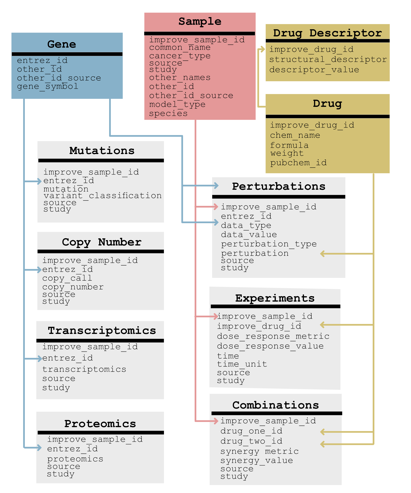

## coderdata LinkML Schema
We have encoded the coderdata schema in [linkML](), a schema
definition language that allows for easy operability with Python, OWL,
JSONSchema, and other schema definition libraries. 

### To validate schema
To validate any files you choose to add, you have to download the
linkml-validate python package:
```
pip install linkml-validate
```

Then you can choose to validate any of the schema classes in our
model. Currently we have the following objects in our model:

| Object | Description | 
| --- | --- |
| Gene | Human gene identifiers|
| Samples | Samples in which omics and drugs are measured | 
| Drugs | Drugs evaluated on samples |
| Drug Descriptor | Computational descriptions of drug properties |
| Transcriptomics | Gene exrpression data |
| Mutations | Gene mutation data |
| Copy Number | Copy number data |
| Proteomics | Proteomics data|
| Experiments | Drug experiments that measure the viability of the cell | 
| Perturbations | Experiments that measure molecular changes of the cell | 
| Combinations | Synergy calculations from pairs of drugs


### Schema image

The data model is shown here:


